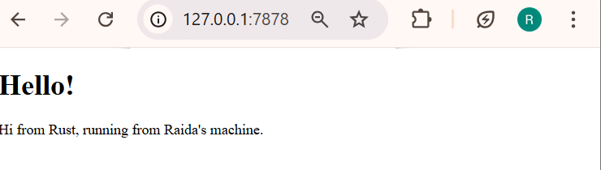
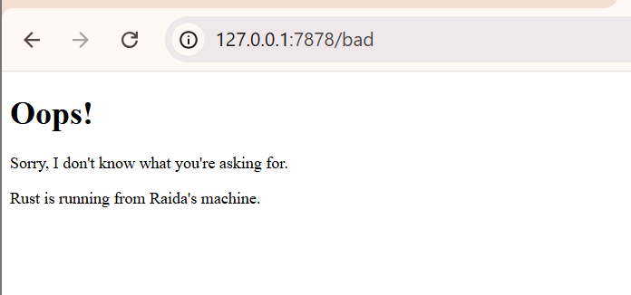
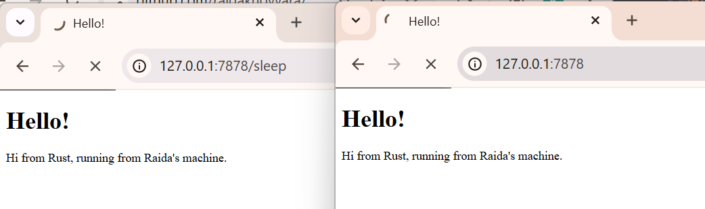
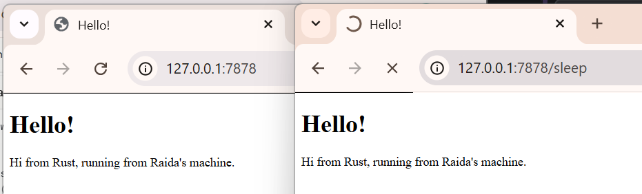

# Rust Web Server — Reflection Notes

## Milestone 1 — Handle Connection & Check Response
Saya mengimplementasikan web server single-threaded sederhana menggunakan Rust yang menerima koneksi TCP di `127.0.0.1:7878`. Saya menggunakan `TcpListener::bind()` untuk mengikat server ke alamat tersebut, lalu `incoming()` untuk mengiterasi koneksi masuk secara sekuensial dalam sebuah loop.

Untuk membaca request, saya membungkus `TcpStream` dengan `BufReader` agar bisa membaca baris demi baris secara efisien. HTTP request di-parse dengan mengumpulkan baris-baris tersebut hingga menemukan blank line, yang menandai akhir dari headers sesuai protokol HTTP/1.1.

- Browser sering mengirim beberapa koneksi sekaligus untuk favicon, retry, dll
- "Refused to connect" berarti tidak ada proses yang listen di port tersebut, sedangkan "didn't send any data" berarti koneksi berhasil tapi server belum mengirim response yang memang terjadi di milestone ini karena belum ada logic untuk menulis response

---

## Milestone 2 — Returning HTML

Saya memodifikasi fungsi `handle_connection` agar server bisa mengirimkan HTTP response yang valid dan bisa di-render browser. Saya menggunakan `fs::read_to_string()` untuk membaca file `hello.html` dari disk, lalu membuat response string menggunakan `format!()`.

Response yang saya buat mengikuti struktur HTTP/1.1:
- **Status line**: `HTTP/1.1 200 OK`
- **Header**: `Content-Length: {length}`
- **Blank line + Body**: `\r\n\r\n` sebagai pemisah antara header dan body HTML

Saya menggunakan `stream.write_all(response.as_bytes())` untuk mengirim response sebagai raw bytes ke TCP stream. Yang menarik, server tidak perlu memahami CSS atau JavaScript sama sekali, server hanya mengirim raw HTML, dan browser yang bertanggung jawab untuk parsing dan mengambil resource eksternal seperti Google Fonts.

---

## Milestone 3 — Validating Request & Selective Response

Saya menambahkan validasi request sehingga server tidak selalu mengembalikan `hello.html` untuk setiap request. Saya mengekstrak request line pertama dan membandingkannya: jika `GET / HTTP/1.1`, server merespons dengan `hello.html` dan status `200 OK`; jika tidak cocok, server merespons dengan `404.html` dan status `404 NOT FOUND`.

Saya juga melakukan refactoring karena cabang `if` dan `else` awalnya hampir sama keduanya membaca file, menghitung panjang, memformat response, dan menulis ke stream. Saya mengisolasi hanya dua hal yang berbeda (`status_line` dan `filename`) ke dalam satu ekspresi `if/else` yang mengembalikan tuple. Rust memungkinkan `if/else` digunakan sebagai expression yang mengevaluasi ke sebuah nilai, sehingga logic sisanya cukup ditulis satu kali jadi lebih bersih dan sesuai prinsip DRY.

---

## Milestone 4 — Simulation of Slow Request

Saya menambahkan route `/sleep` yang memanggil `thread::sleep(Duration::from_secs(10))` sebelum mengirim response, untuk mensimulasikan request yang butuh waktu lama seperti query database berat atau pemanggilan external API.

Saat saya membuka dua tab — satu ke `/sleep` dan satu ke `/` — tab kedua sepenuhnya frozen sampai request pertama selesai. Ini terjadi karena server berjalan di satu thread; loop `for stream in listener.incoming()` memproses satu koneksi pada satu waktu secara sekuensial. Selama thread terblokir di `thread::sleep()`, tidak ada koneksi lain yang bisa diproses. Inilah motivasi utama untuk menggunakan concurrency di milestone berikutnya.

---

## Milestone 5 — Multithreaded Server using ThreadPool

Saya meng-upgrade server ke multithreaded dengan mengimplementasikan `ThreadPool` yang berisi sejumlah worker thread yang di-spawn saat pool diinisialisasi. Daripada spawn thread baru untuk setiap request, pool menggunakan kembali thread yang sudah ada — pendekatan ini lebih aman dan tidak rentan terhadap DoS attack.

Saya menggunakan `mpsc::channel` untuk mengirim job (berupa closure) dari `execute()` ke worker thread yang sedang idle. Untuk berbagi receiving end channel di banyak worker, saya membungkusnya dalam `Arc<Mutex<>>`: `Arc` memungkinkan banyak thread memegang ownership secara bersamaan, sementara `Mutex` memastikan hanya satu worker yang bisa mengambil job pada satu waktu — mencegah race condition.

Saya juga mengimplementasikan `Drop` trait pada `ThreadPool` untuk graceful shutdown: saat pool di-drop, sender di-drop terlebih dahulu sebagai sinyal ke semua worker bahwa tidak ada job baru, lalu setiap worker thread di-join satu per satu agar semua pekerjaan yang sedang berjalan selesai sebelum program exit.

Hasilnya, request `/sleep` dan `/` kini bisa diproses secara bersamaan tanpa saling memblokir.

---
## Bonus — Function Improvement: `build` vs `new`

Saya mengganti fungsi `new()` dengan `build()` yang mengembalikan `Result<ThreadPool, PoolCreationError>`. Sebelumnya, `new()` menggunakan `assert!(size > 0)` yang langsung menyebabkan program panic jika kondisi tidak terpenuhi — caller tidak punya kesempatan menangani error.

Dengan `build()`, caller memiliki kontrol penuh: bisa fallback, log error, atau exit secara graceful menggunakan `match` atau `unwrap_or_else`. Saya juga mengimplementasikan `fmt::Display` pada custom error type `PoolCreationError` agar error message bisa ditampilkan dengan baik. Pendekatan ini lebih robust dan selaras dengan filosofi Rust yang membuat error handling eksplisit dan composable.

| Aspek | `new` | `build` |
|---|---|---|
| Return type | `ThreadPool` | `Result<ThreadPool, Error>` |
| Error handling | Panic langsung | Return `Err` ke caller |
| Kontrol caller | Tidak ada | Penuh |